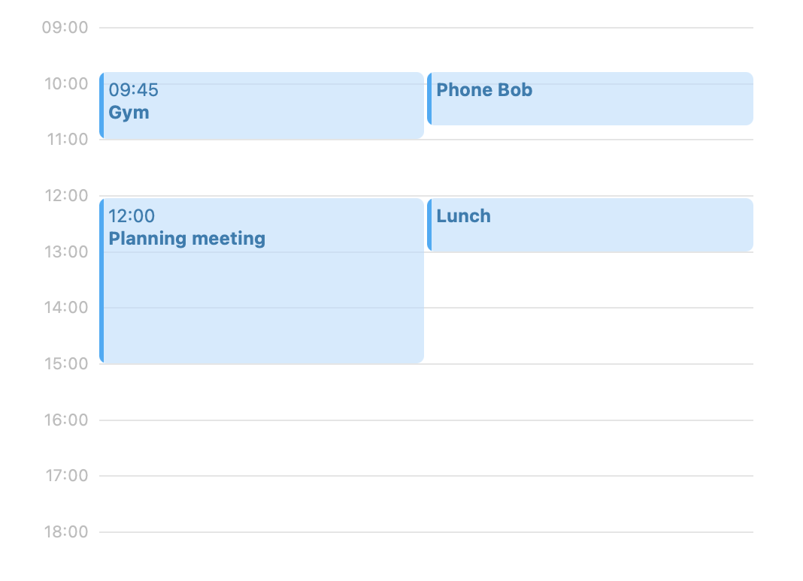

# Pace gets organised 📅

Thank you for taking the time to interview with Pace! We have a coding exercise we would like you to do to show us your skills, and give us something to talk about in our technical interview.

## Expectations

The exercise was designed to be solvable in an afternoon, yet a robust and comprehensive solution could take much longer. Rather than building a complete solution, please constrain yourself to around **three hours**, and use a shortup writeup to mention anything not achieved or any known limitations.

## Requirements

We would like to build a simple day view for a calendar, populated with data from a graphql API. The API returns a list of events which have a start and end time in minutes since midnight. So 9am is 540 minutes, 9.30 is 570 minutes and so on.

When rendering the calendar:

- Events should be shown without any overlapping
- If multiple events collide, then they should have equal width
- Styling can be kept extremely simple
- We only need to display the events

Your submission should also be reflective of how you would write production quality code, but don't fret if you run out of time - we aren't expecting polished solutions.

## Writeup

Written communication and thoughtful self-reflection is an important part of our work. This is an opportunity for you to tell us a bit more about the work you did. The writeup shouldn’t be long, but we will use it as part of the evaluation and discuss it in subsequent interview, so you should spend a bit of time and focus on it.

Here are some example questions your writeup could address:

- What choices did you make and why?
- What challenges did you face?
- What tradeoffs did you choose?
- What do you like and not like about your solution?
- What areas would you work on next?

We love feedback. If there’s anything you think could be improved with this exercise, please share your thoughts in the writeup, too.

## Technologies

We've gotten you started using a [next.js](https://nextjs.org/) boilerplate including sample data. If you're not familar with the framework then no problem, we don't use any of its additional features here or require server-side rendering. To complete the requirements:

- You may use any open source, publicly available third party libraries or components you would like **except calendar components like [fullcalendar](https://fullcalendar.io/)**.
- You may use any testing framework or approach you prefer, or not write tests at all.

## Deliverables

We expect you to deliver:

1. Source code of a web app that fulfils, as far as possible, the above requirements and uses the specified technologies, delivered in form of a Git repository. The Repository can be public or private, on GitHub, GitLab or BitBucket, CodeSandboxed, or zipped and emailed to us.
2. A short writeup of your work in form of a Markdown readme in the project.

Good Luck and have fun!

Once completed, please email your solution to ben@pacerevenue.com. If you have any questions, please let us know!
